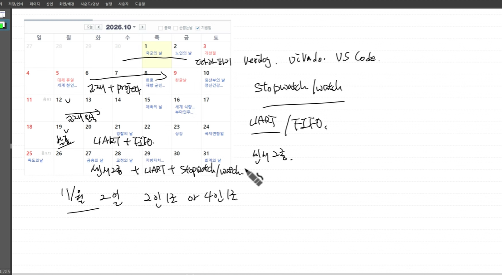
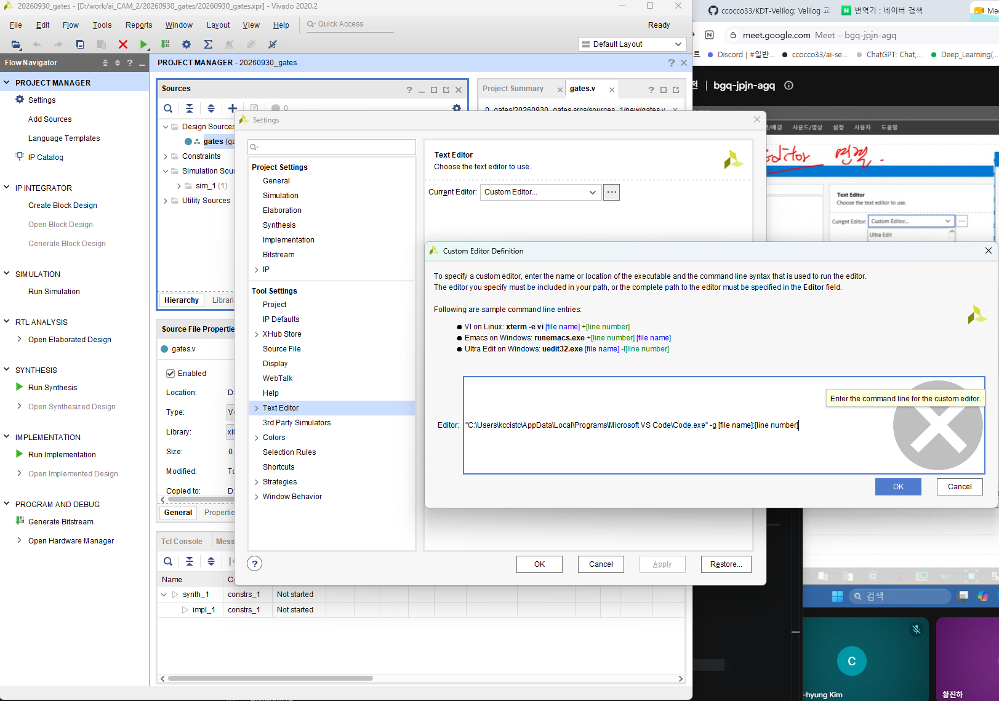

# 2026.09.30

## OT
- 빠지지 말기.
- 수업때 AI 쓰지말기
- 잘모르겠으면 다시 설명해달라고 그냥 말하기
- 소스 관리 해라.(git hub) / 개인 포폴은 notion
- (첫달) vivado : 2020.2 ver //26버전은 절대안된다. , 뭐 정 최신거 쓰고싶으면 25 / 한글 주석 깨진다.
- (이후) vcs
- 에디터: vs code (권장 vim  , 리눅스기반, 이게 실제로 쓰는거, 리눅스 쓰는거 연습, 타이핑으로 내가 직접쓰는걸로 연습/ 우리는 교육이니까)

하드웨어적인 디버깅, 컨셉

설계쪽 많이 안뽑음 (많이 노력해야함)
검증, 구성 어플리케션.. 이게 훨씬 많음 , 방산쪽 fpga 이건 많지는 않긴함, 

## 간단 일정
1~2 : 따라하는 베릴로그, vivado, vs code, 타이핑 속도 연습
6~13: 교재, 프로젝트
12 or 19 발표 (19일듯) / 2인 1조 인당 5분

stopwatsh/watch
liart fifo 19일 주
센서2종+liart fifostopwatsh/watch 26일 주

11월
2일: 발표 / 2 or 4인 1조 

system verilog -> cpu 설계 배움

vivado: fpga 통합 개발 툴 (xilinx에서 만듬, 마이크로 칩으로 인수됨) rtl 로 만든 칩설게를 여기서 돌릴수 있음 / 로직만든거 돌아가는거임
하드웨어 랭귀지 : verilogHDL, VHDL 서로 호환 안됨, 아시아에서는 베릴로그/VHDL 유럽,교수 //vivado는 두개 언어 다 지원, 우리는 verilog 배움

fpga로 설계한걸 ~로 하는 툴 

- 베릴로그는 모듈이 기본 단위임 / 모듈안에 펄션있고 클래스있고
- 모두가 알수있게 코드 작성(이건 칩에 올리면 수정 못하니까) , 보기도 좋게
top_module: vivado 에서 auto detection / 하이라키에서 제일위에있는 모듈

### vivado : source code - vscode 연결

systemVerilog and,,,, 설정: --column_limit 80 --indentation_sapace 4
verilog,,,: 

vim(vi) 단축키같은거 공부,,,,,,,,

.xpr 프로젝트 메니지 파일
.srcs 소스 디랙토리 .../new ...: ~~ .../import:addfile
.sim 시뮬 디렉토리

ctrl + shift +p => systemVerilog fortmat  => 자동 정렬

1s
1ms =>

` : grave accent

ppt에 시뮬 넣었으면 얘가 0이고 얘가 머고 이런거 설명학. 왜 값을 바꿨는지 등.. 

보드에 올라다가 문제나면 작업관리자 -> cs_server꺼버리고 다시 해보기

vivado - 2020.2 / 언어팩 한글안됨(윈도우 한글이어야함) / allos installer winlock or *sevenzip*으로 풀어야함
ml.enter,,
